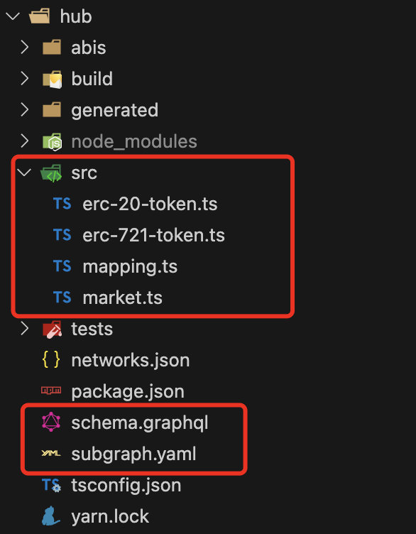

> 这是一个系列教程。通过自己实现一个 NFT 项目，讲解 The Graph 的使用。

**本篇是这个系列的第二篇：创建 Graph 并初始化。**

<br>

**导航链接**

[TheGraph 实操（一）准备一个 NFT 项目]()  
[TheGraph 实操（二）创建 Graph 并初始化]()  
[TheGraph 实操（三）构造 entity 实现检索]()  
[TheGraph 实操（四）Graph 高级用法]()

---

<br>

**1、The Graph 简介**

> `The Graph` 有两种服务：
>
> 1. `Hosted Service`: 免费、中心化托管服务、临时方案，等 `Subgraph Studio`服务稳定后会逐步停止服务。
>
> 2. `Subgraph Studio`: 收费、分布式服务、这个是`The Graph`致力于要建设的服务，最终都会以这个方式提供服务。收费方式类似于区块链的 gas 费，用于激励提供服务的节点 indexer
>
> 由于直接从区块链无法进行复杂的查询，自建服务查询需要 扫块，把数据存储在 Mysql 等需要维护服务器、还有 单点故障、rpc 限流、rpc 不稳定 等原因，成本较高。使用`Subgraph Studio`可以做到无后端服务器，只需要部署前端页面的服务器，虽然收费，但也比自建服务要节省成本。
> [点击查看自建服务与 TheGraph 成本对比](https://thegraph.com/docs/en/network/benefits/)。

<br>

**2、创建一个 subgraph**

点击进入官网 <https://thegraph.com/hosted-service/dashboard> 使用 github 账号登录后即可创建一个 `subgraph`。创建完成会出现如下图这样：  

PS: 可以按照图片提示完成本地环境的安装，可以直接复制他的命令操作，这里给出我的做法。**_上图右上角的 access token 是用来部署的，后面有用。_**

1.  全局安装：`yarn global add @graphprotocol/graph-cli`

2.  初始化本地项目

    ```
    graph init --product hosted-service [这里是你的subgraph名字]
        > Protocol · ethereum [选择ethereum生态]
        > Ethereum network · mumbai [如果是 bsc测试网 请选择 chapel]
        > Contract address › [填入合约地址，这里会自动拉取 abi，如果合约没有验证，会提示 选择本地的 abi]
    ```

3.  初始化成功，目录结构是这样的：
      
    我们需要编辑的只有 3 个文件，其他都是通过 `graph codegen`生成的。

        -  ./src/mapping.ts 这里是 解析合约事件，保存数据，可以通过entity自定义数据组织。
        - schema.graphql 自定义entity
        - subgraph.yaml 部署配置文件

    [schema.graphql 语法文档，往下滑，在下半部分](https://thegraph.com/docs/en/developing/creating-a-subgraph/)  
    [mapping.ts 语法文档](https://thegraph.com/docs/en/developing/assemblyscript-api/)

<br>

本篇到这里就结束了，下一篇 编写 entity 检索数据，敬请期待
